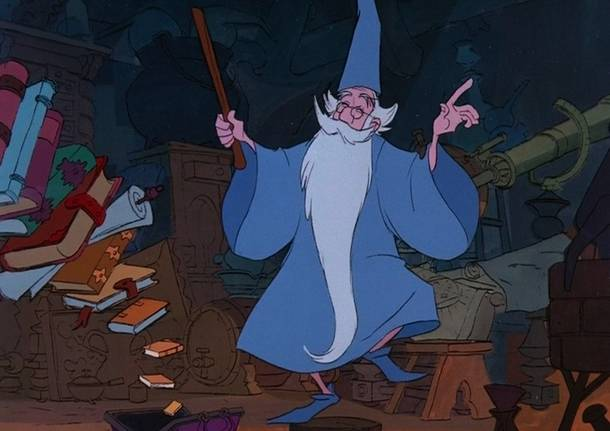
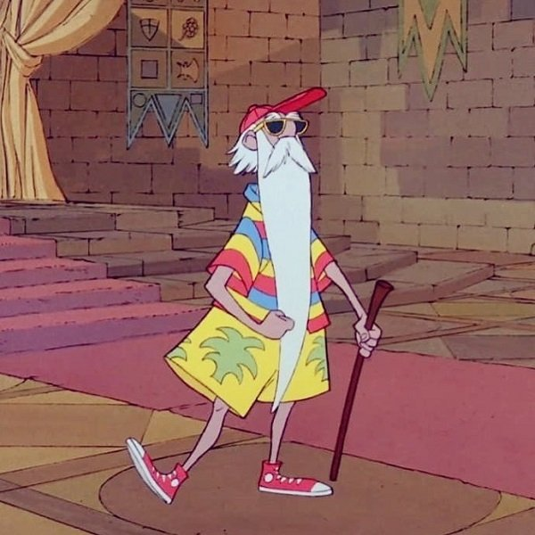

```{r setup, include=FALSE}
knitr::opts_chunk$set(echo = TRUE, 
                      eval = TRUE, 
                      message = FALSE, 
                      prompt = TRUE, 
                      comment="", 
                      tidy=TRUE, 
                      warning = FALSE, 
                      fig.align = "center", 
                      out.width = "50%")

hook_output <- knitr::knit_hooks$get("output")
knitr::knit_hooks$set(output = function(x, options) {
if (!is.null(n <- options$out.lines)) {
x <- xfun::split_lines(x)
if (length(x) > n) {
# truncate the output
x <- c(head(x, n), "....\n")
} 
x <- paste(x, collapse = "\n")
} 
hook_output(x, options)
})
library(knitr)
```

# Introduzione

## Due facce della stessa medaglia

\begin{figure}
\centering
\begin{subfigure}{0.3\textwidth}
```{r echo = FALSE, out.width="80%"}

```
\caption{Senza spritz.}
\label{sub:nospritz}
\end{subfigure}
\pause
\begin{subfigure}{0.3\textwidth}
```{r out.width="80%", echo = FALSE}

``` 
\caption{Con spritz.}
\label{sub:spritz}
\end{subfigure}
\caption{Mago Merlino}
\label{fig:merlino}
\end{figure}

## Equazioni

\begin{equation}\label{eq:mean}
	\bar{X} = \frac{\sum_{i=1}^{n} x_i}{n}
\end{equation}

## Plot

```{r}
plot(cars)
```

## Colonne

\begin{columns} 
\begin{column}{0.50\textwidth}

Testo nella prima colonna

\end{column}

\begin{column}{0.50\textwidth}

Testo nella seconda colonna

\end{column}

\end{columns}


## Codice 

```{r echo = TRUE}
data = cars
```

