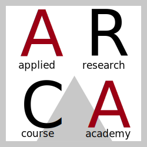
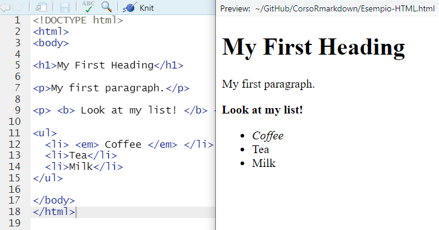
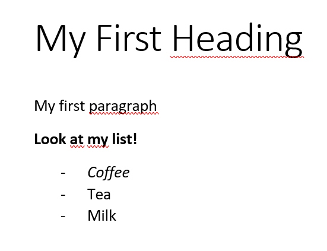

```{r setup, include=FALSE}
knitr::opts_chunk$set(echo = FALSE)
```



## `RMarkdown`: cos'è

`RMarkdown` è il markup language di `R`. Cosa vuol dire questa frase? Partiamo con il dire che "markup language" identifica un linguaggio di programmazione dove vengono usati brevi pezzi di codice, detti **tags**, per cambiare l'aspetto del testo. In poche parole, la formattazione del testo è controllata dal codice con cui è scritto. Ancora poco chiaro? Non preoccupatevi, è normale. Un esempio classico di markup language è il codice HTML usato per i siti e le pagine online: 

```{r fig.align="center", out.width="50%", fig.cap="Testo in HTML"}

```


Probabilmente siete abituati a Word (o software affini), dove la formattazione del testo èa ffidati a specifici pulsanti o, alla meglio, alla combinazione di tasti. Ad esempio, se volete mettere in grassetto un pezzo di testo, basta che lo evidenziate e che selezioniate l'opzione "**G**" oppure che premiate la combinazione di tasti `ctrl + G`. Word è definito un linguaggio WYSIWYG, ossia **W**hat **Y**ou **S**ee **I**s **W**hat **Y**ou **G**et: 

```{r fig.align="center", out.width="50%", fig.cap="Testo in Word"}

```


In realtà, `Markdown` è un markup language che esiste indipendentemente da `R`. Quello che ha "in più"  `RMarkdown` rispetto all'omonimo senza `R` è la possibilità di integrare codice di analisi dati e testo nello stesso file. In questo modo, si possono generare i grafici da inserire in un report direttamente all'interno del file di report stesso, non si perdono i codici che si sono usati per le analisi (sì, succede), dati e report vivono nello stesso file e si hanno maggiori garanzie rispetto alla replicabilità dei risultati. Ma soprattutto...avete mai provato a spostare un'immagine all'interno di un file Word...?

# Installare `RMarkdown`

Per installare `RMarkdown`:

- [Download ](https://cran.r-project.org/bin/windows/base/) [Installare R seguendo il prompt di installazione]

- [Download ](https://www.rstudio.com/products/rstudio/download/) [Installare RStudio seguendo il prompt di installazione]

- [Download ](https://miktex.org/download) [Installare MikTex seguendo il prompt di installazione]

Dopo aver installato tutti i programmi, aprire `RStudio`. Nel pannello `Console` di `RStudio` digitare: 

    install.packages("RMarkdown")

e premere `Invio`. 

## Check

Per controllare se si è svolta tutta la procedura correttamente, scaricare il file con estensione `.Rmd` da https://drive.google.com/drive/folders/1OW61q2oRXi_HgPj0woayPJusoAYUXmsE, aprirlo in `RStudio` e cliccare su `knit`. Se la procedura di installazione è andata a buon fine, dovreste riuscire ad ottenere un PDF del file. Nel caso non riusciste a compilare il file, mettetevi in contatto con me al più presto (ottavia.epifania@unipd.it)

# Piccolo questionario

Ho preparato un piccolo [questionario](https://forms.gle/DLsnVT5JSKfGZ8487) per conoscervi meglio. Vi chiedo per favore di compilarlo **entro il 13 giugno**. 

Grazie e a prestissimo!

## Resources

Se volete vedere cosa vi aspetta, a [questa pagina](https://bookdown.org/yihui/rmarkdown/) è disponibile una guida completa a `RMarkdown`

A [questa pagina](https://rmarkdown.rstudio.com/gallery.html) trovate la galleria delle cose che  si possono ottenere con `RMarkdown`
