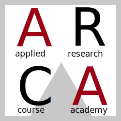

# Corso `RMarkdown`

Benvenuti! In questa pagina sono presenti tutti i link a materiale necessario per il crso e a qualche risorsa in più per saziare tutti gli appetiti di conoscenza. 

- [Getting started](Istruzioni-base.html): il punto da cui partire. Una piccola guida che vi spiega passo passo come installare `RMarkdown`
- [File check](https://drive.google.com/file/d/1holNW8FnqH-qqqOTcxxJCo4WpoJtl1jO/view?usp=sharing): Per vedere se avete seguito correttamente le istruzioni e soprattutto se l'installazione è andata a buon fine, potete scaricare il file di prova in estensione Rmd.
- [Foglio di assegnazione dei dataset](https://docs.google.com/document/d/1xBr-zNRTvUrKABrU7CQDM_8rZVg2gmij_aaP-0laljM/edit?usp=sharing) 
- [Datasets e codici](Datasets-Codici.html) per le esercitazioni

## Il corso

Il corso si svolgerà a Padova, dal 14 al 17 giugno:

- 14 giugno: 13:00-18:00
- 15 giugno: 09:00-14:00
- 16 giugno: 09:00-14:00
- 17 giugno: 09:00-14:00 

Alla fine del corso chiederò a ogni studente di produrre una piccola presentazione in `RMarkdown` e un file di report sul dataset usato durante i giorni di lezione. Questi file li preparemo insieme durante il corso stesso, dove infatti le ore di lezione frontale sono intervallate da esercitazioni pratiche.

Ma partiamo dall'inizio: 

- Introduzione: Cos'è `RMarkdown`, perché lo usiamo, `R` project. [HTML](slides/00 - Introduzione/00-Introduzione.html) [PDF](slides/00 - Introduzione/00-Introduzione.pdf)
- Baby steps: Prendiamo confidenza con `RMarkdown` [HTML](slides/01 - Baby Steps/01-Baby-Steps.html) [PDF](slides/00 - Baby Steps/00-Introduzione.pdf)
- Chunk di codice: L'essenza di `RMarkdown` va conosciuta nel dettaglio [HTML](slides/02 - Chunk di codice/02-Chunk-di-Codice.html) [PDF](slides/02 - Chunk di codice/02-Chunk-di-Codice.pdf)
- `knitr` e Latex: Un rapporto che va conosciuto [PDF](slides/03 - LaTeX/03-LaTeX.pdf)
- Presentazioni in `RMarkdown` [HTML](slides/04 - Presentazioni/04-Presentazioni.html) [PDF](slides/04 - Presentazioni/04-Presentazioni.pdf)

## Materiale utile

- [Dillinger](https://dillinger.io/)

- [Shiny widgtes](https://shiny.rstudio.com/gallery/widget-gallery.html)

- [Chunk options](https://yihui.org/knitr/options/)

- [Compilatore automatico di tabelle `RMarkdwon`](https://www.tablesgenerator.com/markdown_tables)

- [Stile presentazioni di LaTeX](https://deic.uab.cat/~iblanes/beamer_gallery/)

- [Generatore di tabelle in LaTeX](https://www.tablesgenerator.com/)
