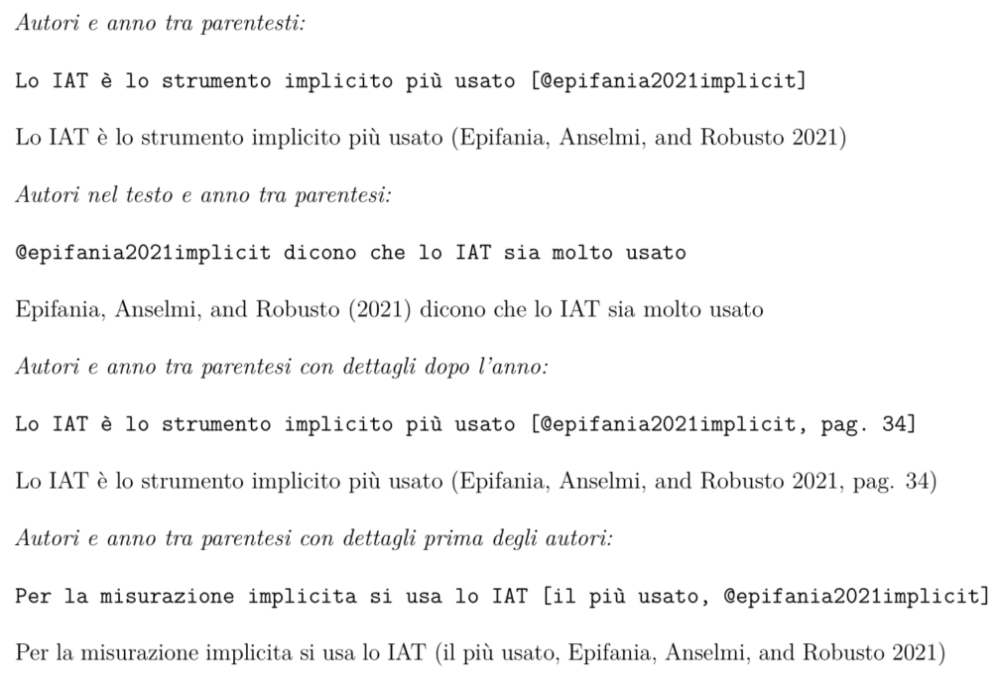

<style>
.forceBreak { -webkit-column-break-after: always; break-after: column; }
</style>

```{r setup, include=FALSE}
knitr::opts_chunk$set(echo = FALSE, 
                      fig.align = "center")
library("icons")
library("emoji")
```


```{r functions, include=FALSE}
put_image <- function(name){
 img <- file.path("img", name)
 knitr::include_graphics(img)
}
```


## Creare un nuovo file `RMarkdown` {.build}

<div align="center">
Easy peasy `r emoji("lemon")` squeezy:  
</div>

<div style="float: left; width: 50%;">

```{r, out.width="80%"}
knitr::include_graphics(path = "img/new00.png")
```

</div>

<div style="float: right; width: 50%;">

```{r, out.width="80%"}
knitr::include_graphics(path = "img/new01.png")
```
</div>


## Default file `RMarkdown`

Come prima cosa, appare questo: 

```{r echo = TRUE, eval=FALSE}
---
title: "Esempio di File di testo"
author: "Ottavia M. Epifania"
date: "5/3/2022"
output: html_document
---
```

Questo è l'header YAML ed è dove andiamo a definire il tipo di file che vogliamo, il titolo, l'autore, la data. 

Per compilare il file si può premere sul tasto **knit** oppure si può usare la combo di tasti `shift + ctrl + k` (per chi ha il Mac `shift + cmd + k`)

Siccome nel nostro header abbiamo `output: html_document` (il default), il file compilato sarà un file `html` 

## Your turn!

- Create un nuovo file 

- Date un titolo a scelta

- Cliccate "knit"!

<div align="center">
ADAVANCED
</div>

- Mettere un sottotitolo
- Togliere la data

## Dettagli sulla compilazione 

Si può scegliere il tipo di file da compilare cambiando da `output: html_document` a `output: pdf_document` (Questa operazione si può svolgere anche cliccando sulla freccina accanto a **knit** e selezionando "Knit to PDF")

Nel caso abbiate seguito la seconda strada, viene modificato lo YAML del file: 

```{r echo = TRUE, eval=FALSE}
---
title: "Esempio di File di testo"
author: "Ottavia M. Epifania"
date: "5/3/2022"
output: 
  pdf_document: default
  html_document: default
---
```

Ma non preoccupatevi, è la stessa cosa! 


## Tutti per lo YAML, uno YAML per tutto

Nello YAML andiamo ad indicare varie specifiche del nostro file (che vedremo in seguito). 


Per ora, aggiungiamo un sottotitolo: 

```{r,echo = TRUE, eval=FALSE}
---
title: "Esempio di File di testo"
subititle: "Ecco il sottotitolo"
author: "Ottavia M. Epifania"
date: "5/3/2022"
output: 
  pdf_document: default
  html_document: default
---
```


## Si possono pure togliere pezzi {.build}

<div>
La data non sta molto bene: Provate a toglierla!
</div>

<div>
```{r,echo = TRUE, eval=FALSE}
---
title: "Esempio di File di testo"
subititle: "Ecco il sottotitolo"
author: "Ottavia M. Epifania"
date: ""
output: 
  pdf_document: default
  html_document: default
---
```
</div>

# Gli headers

## Cosa sono

Sono i titoli delle sezioni, sottosezioni e dei pargrafi

<div style="float: left; width: 50%;">
    # Header 1
    
    ## Header 2
    
    ### Header 3
    
    #### Header 4
</div>

<div style="float:right; width: 50%;">
Titolo di una sezione

Titolo di una sottosezione

Titolo della sotto-sottosezione <font size="2">(seriously)</font>

Titolo del paragrafo

</div>

## Come si usano {.build}

<div>
    # Header 1
    
    Brividi brividi brividiiiiiii


```{r, out.width="30%"}
knitr::include_graphics(path = "img/header1.png")
```
</div>

<div>

<font size="3">Anche tutti gli altri header funzionano così, ad eccezione di `#### Header 4` </font>

    #### Titolo di un paragrafo
    
    Testo del paragrafo molto importante
    

```{r, out.width="50%"}
knitr::include_graphics(path = "img/header4.png")
```

</div>

## I numeri di sezione

Per aggiungere i numeri delle sezioni, basta aggiungere allo YAML

<div style="float: left; width: 50%;">

```{r echo =TRUE, eval = FALSE}
---
title: "Esempio di File"
subtitle: Sottotitolo
date: "5/3/2022"
author: Ottavia M. Epifania
  output:
    pdf_document: 
    number_sections: true
---
```

</div>


<div style="float: right; width: 50%;">

```{r out.width="50%"}
knitr::include_graphics(path = "img/numeHeader.png")
```

</div>


## Table of contents

Per aggiungere l'indice, bisogna modificare lo YAML, aggiungendo l'element `toc`(**T**able **O**f **C**ontents)

```{r echo= TRUE, eval = FALSE}
---
output:
  pdf_document: 
  number_sections: true
  toc: true
---  
```


con l'argomento `toc_depth` si può specificare il livello di profondità dell'indice. 

Con `toc_depth: 1` vengono riportati solo i  titoli delle sezioni (Header 1), con `toc_depth: 2` i titoli delle sezioni e sottosezioni (Header 1 e 2, default) e via discorrendo.

## Your turn

- Creare un documento 
- Usare il nome del vostro dataset come titolo
- Sottotitolo a scelta
- Al posto della data $\rightarrow$ Università di Padova

<div align="center">
<span style="color:#FF0000">ADAVANCED</span>
</div>

- Aggiungere almeno 3 headings (e.g., "Titolo 1", "Titolo 2", "Titolo 3")
- Table of contents

# Formattazione del testo

## Interlinea & Margini

YAML: 

```{r echo= TRUE, eval = FALSE}
---
output:
  pdf_document: 
   number_sections: true
      toc: true
      toc_depth: 1
  linestretch: 1.5
  geometry: margin=1in
---  
```


     

## Corsivo, grassetto, corsetto, colori

<div style="float: left; width: 50%;">
    *Corsivo*
    
    **Grassetto**
    
    ***Corsetto***
</div> 

<div style="float: right; width: 50%;">
*Corsivo*
    
**Grassetto**
    
***Corsetto***
</div>

</br>

<div align="left">


    \textcolor{red}{Parola molto colorata in \LaTeX/PDF}
    
    <span style="color:red">Parola molt colorata in HTML</span>

</div>

## Your turn!

- Modificare i margini del documento a 0.5in
- Impostare l'interlinea di un punto e mezzo
- Mettere delle parole in corsivo, grassetto e corsetto
- Aggiungere delle parole colorate

<div align="center">
<span style="color:#FF0000">ADAVANCED</span>
</div>

- Aggiungere una **<span style="color:#FF0000">parola colorata</span>** in **grassetto**
- Aggiungere una *<span style="color:green">parola colorata</span>* in *corsivo*
- Aggiungere una ***<span style="color:blue">parola colorata</span>*** in ***corsetto***

## Block quote {.build}

<div>
Molto semplicemente, si fa precedere il testo da `>`: 

    Una canzone de "La rappresentante di lista", presentata a Sanremo 2022
    > Come stai bambina?
     Dove vai stasera?
     Che paura intorno
     È la fine del mondo
     Sopra la rovina sono una regina
     Ma-ma-ma
     Ma non so cosa salvare
</div>

<div>
```{r, out.width="70%"}
knitr::include_graphics(path = "img/block.png")
```

</div>

## Elenchi {.build}

<div style="float: left; width: 50%;">

<h3> Unordered list </h3>

    - Chimica
    - Ciao Ciao
    - Brividi
    - Domenica

- Chimica
- Ciao Ciao
- Brividi
- Domenica
   
</div>


<div style="float: right; width: 50%;">

<h3> Ordered list </h3>

    1. Brividi
    2. La canzone di Elisa
    3. Gianni Morandi
    4. Non mi ricordo

1. Brividi
2. La canzone di Elisa
3. Gianni Morandi
4. Non mi ricordo

</div>


## Elenchi annidati {.build}

Basta mettere tre spazi sull'elenco che si vuole annidare: 

<div style="float: left; width: 50%;">

    - Un elenco
        - Voce del secondo elenco
        - altra voce del secondo elenco
    - Seconda voce del primo elenco

</div>


<div  style="float: right; width: 50%;">

- Un elenco
    - Voce del secondo elenco
    - altra voce del secondo elenco
- Seconda voce del primo elenco

</div>

## Your turn

- Creare una unordered list
- Creare una ordered list
- Annidare una unordered list in una ordered list

<div align="center">
<span style="color:#FF0000">ADAVANCED</span>
</div>

- Inserire una list a scelta (ordered o unordered) in un block quote
- Inserire una lista a scelta (ordered o unordered) dentro un'altra lista a scelta dentro un block quote (Inception style `r emoji("smiling face with sunglasses")`)

# Inserire immagini 

## `Markdown` style vs. `RMarkdown` PT. I {.columns-2 .smaller .build}


<h4> `Markdown` </h4>

<div>
</br>

``


</div>

<p class="forceBreak"></p>

<h4> `RMarkdown` </h4>

</br>

<div>

````
```{r, fig.cap = "Caption", fig.align="center", out.width="50%"}`r ''`
knitr::include_graphics(path = "percorso-alla-figura")
```
````
```{r, fig.cap="Dopo il corso `RMarkdown`"}

```

<font size="3">`fig.align` (cambia l'allineamento della figura), `out.width` (cambia la dimensione dell'immagine modificandone la larghezza, l'altezza si adatta automaticamente)</font> 
</div>

## `Markdown` style vs. `RMarkdown` PT. II {.build}

<div align="center">
<h4> `Makdown` </h4>
</br>
</div>

`r emoji("smile")` Più immmediato

`r emoji("smile")` Si "autoaggiusta" al file <font size="2">(non sempre  in modo ottimale)</font>

`r emoji("sad")` Per cambiare qualcosa bisogna ricorrere a HTML


<div align="center">
<h4> `RMakdown` </h4>
</br>
</div>

`r emoji("smile")` Permette di cambiare comodamente posizionamento e dimensioni dell'immagine

`r emoji("sad")` Richiede un po' di scrittura in più


# Le sottocartelle 

## Perché

</br>

In Word o simili siammo abituati a mettere "a mano" le  figure, magari anche la bibliografia $\rightarrow$ si mette tutto nel file di testo 

In `RMarkdown`, le immagini, la bibliografia, gli eventuali dati e i risultati delle analisi devono essere importati all'interno del file

L'importazione è basata sui "percorsi" (le directory) dei file. 

## Come 

Fondalmentalmente in due modi: 

1. Il file che ci interessa è nella stessa cartella del file su cui stiamo lavorando:
   - Questa opzione va bene se abbiamo pochi file da importare
   - Ad ogni modo questa non è una soluzione ottimale $\rightarrow$ troppo disordine

2. Si creano delle sottocartelle divise per tema (e.g., immagini, bibliografia, dati) $\rightarrow$ è la soluzione ottimale che permette di avere tutti i fiile  a disposizione e organizzati in modo lineare

## Un esempio 

```{r out.width="25%"}
knitr::include_graphics(path = "img/sottocartelle.png")
```

Se volessi importare un'immagine nel mio documento chiamata "immagine.png" contenuta nella  cartella "vignettes"  dovrei scrivere: 

````
```{r, fig.cap = "Caption", fig.align="center", out.width="50%"}`r ''`
knitr::include_graphics(path = "vignettes/immagine.png")
```
````
<font size="3"> (Funziona anche usando il codice  ``)</font>

## Your turn!

- Nel vostro progetto, create la  cartella `img` e la cartella `bibliografia`
- Scegliete due immagini da Google immagini <font size="2">(magari inerenti il vostro dataset `r emoji("chicken")`, `r emoji("flower")`, `r emoji("car")`)</font> e salvatele nelle cartella `img`
- Importare le immagini, una con il codice `Markdown`, una con il codice `RMarkdown`

<div align="center">
ADVANCED
</div>

- Importare di nuovo una delle due immagini e allinearla a destra
- Importare di nuovo l'altra immagine e ridurre la dimensione al  10%


# Bibliografia

## Torniamo allo YAML

    output:
      pdf_document: 
      keep_tex: yes
       number_sections: true
       toc: true
       toc_depth: 1
    linestretch: 1.5
    geometry: margin=1in 
    bibliography: biblio.bib

Ecco fatto, messa ma la bibliografia!

Ovviamente, il file `biblio.bib` va creato ex-novo.  

Se si usa questo  codice, la bibliografia deve essere nella stessa cartella del file che stiamo creando. Se  invece è in una sottocarella `bibliography: biblio/biblio.bib`

## Creare `.bib`

`.bib` è l'estensione del file. Sia `R` sia `LaTeX` riconoscono i file `.bib` come file di bibliografia.

Crearli è molto semplice: 

0. Si decide qual è la letteratura rilevante per quello che stiamo facendo
1. si va su Google scholar e si copia la citazione in formato `BibTex`: 

```{r}
knitr::include_graphics(path = "img/bibScholar.png")
```

##

<ol start="3">
  <li> La citazione risulta essere:</li>
</ol>


    ```
    @article{epifania2021implicit,
    title={Implicit social cognition through the years: The Implicit Association Test at age     21.},
    author={Epifania, Ottavia M and Anselmi, Pasquale and Robusto, Egidio},
    journal={Psychology of Consciousness: Theory, Research, and Practice},
    year={2021},
    doi={https://doi.org/10.1037/cns0000305},
    publisher={Educational Publishing Foundation}
    }
    ```
   
<ol start="4">
  <li> La copiaincolliamo in un documento vuoto </li>
  <li> Salviamo il documento con un nome a scelta (e.g., `biblio`) **ma soprattutto** ricordando l'estensione `.bib` </li> 
</ol>

`r emoji("red exclamation mark")` `epifania2021implicit` è la "chiave" che ci permette di citare l'articolo nel testo 

## Come citare nel testo


```{r out.width="80%"}

```


## Your turn

1. Creare un file `.bib` che contenga questi due articoli su Google Scholar:

    > DscoreApp: a shiny web application for the computation of the implicit association test d-score
    >
    > Implicit measures with reproducible results: The implicitMeasures package

2. Salvare il file nella cartella `bibliografia` creata in precedenza

3. Usare entrambe le citazioni con Autori e anno tra parentesi

<div align="center">
ADVANCED
</div>

Sbizzarritevi con le citazioni 

# La matematica  

## Equazioni

Le equazioni vengono risconosciute dal simbolo `$`. 

<h3> Inline equation</h3>

`$3 +2 =5$` risulta in  $3+2=5$, sulla stessa riga del testo che si sta scrivendo

<h3> Equation </h3>

Per scrivere le equazioni come  blocchi di testo a parte,  si usa il doppio dollaro. `$$3 +2 =5$$` diventa $$3+2=5$$  (anche se lo scrivo sulla stessa riga!) 

## Lettere greche, frazioni e simili

Per inserire lelettere greche, basta scrivere la lettera greca che si desidera in caratteri latini all'interno dei dollari, preceduta da `\`. 

Più semplicente, se vogliamo $\delta$, non dobbiamo far altro che scrivere `$\delta$`

Se si vogliono le lettere greche maiuscolo, si mette in maiuscolo la prima lettera latina, per cui `$\Delta$` risulta in $\Delta$  

`$\frac{num}{den}$` permette di scrivere le frazioni (`$\frac{2}{3}$` $\rightarrow$ $\frac{2}{3}$)

`$\sqrt{numero}$` è la radice quadrata (`$\sqrt{4}$` $\rightarrow$ $\sqrt{4}$)

A [questa pagina](https://artofproblemsolving.com/wiki/index.php/LaTeX:Symbols) trovate una luista esaustiva di tutti i simboli matematici

## Font style

- Standard font
- <span style="color:red">Change the font colour</span>
- <font size="1">This is some text size 1!</font>
- <font size="1">This is some text size 1!</font>
- <font size="2">This is some text size 2!</font>
- <font size="3">This is some text size 3!</font>
- <font size="4">This is some text size 4!</font>
- <font size="5">This is some text size 5!</font>
