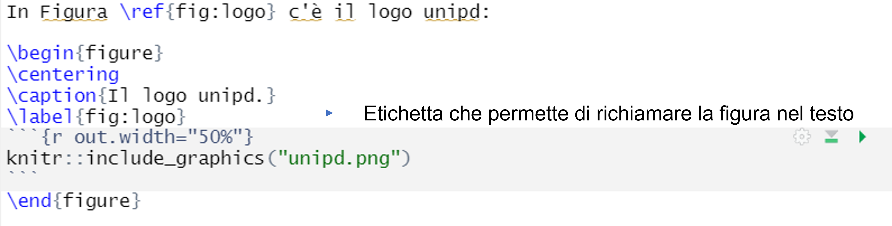

```{r setup, include=FALSE}
knitr::opts_chunk$set(echo = FALSE)
```

## Slide con colonne

\begin{columns}
\begin{column}{.50\textwidth}
testo
\end{column}

\begin{column}{.50\textwidth}
\begin{figure}
\centering
```{r}

```

\end{figure}


\end{column}
\end{columns}