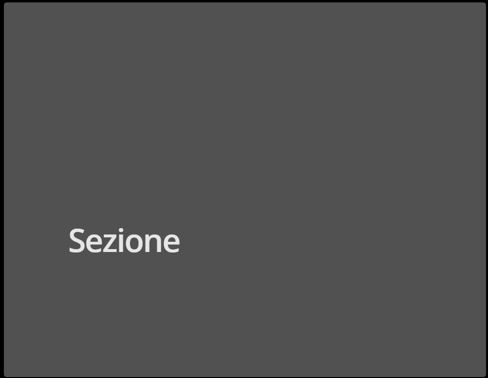
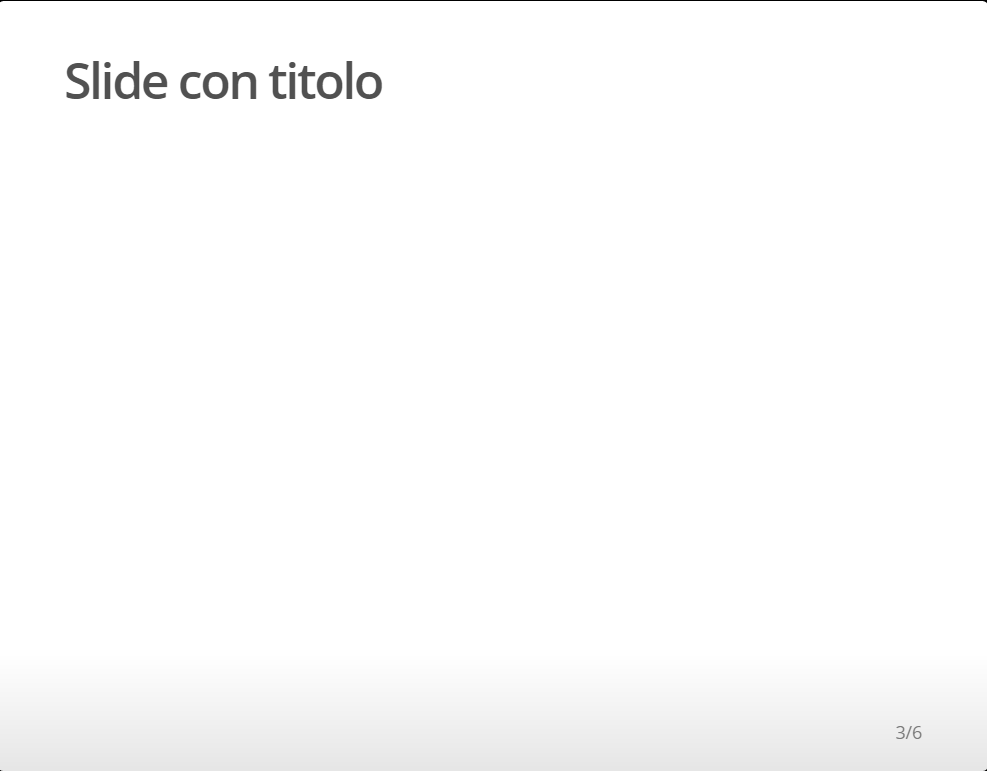
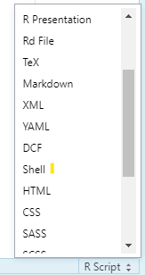
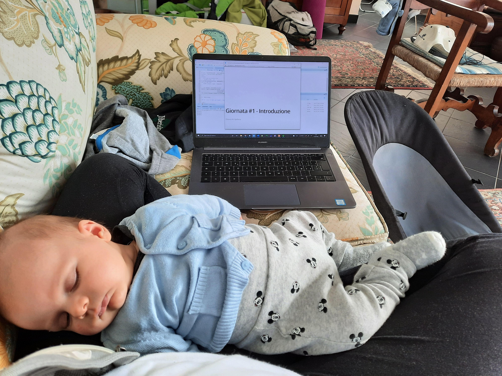
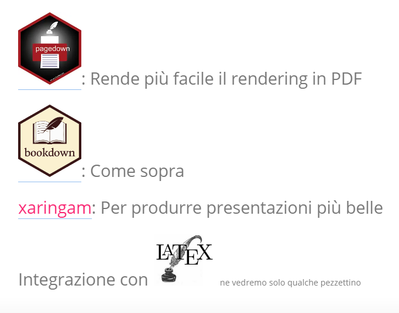

<style>
.forceBreak { -webkit-column-break-after: always; break-after: column; }

.myClass {font-size: 14px;}
</style>

```{css, echo=FALSE}
pre {
  max-height: 700px;
  overflow-y: auto;
}

pre[class] {
  max-height: 500px;
}

.scroll-100 {
  max-height: 500px;
  overflow-y: auto;
  background-color: inherit;
}
/* specify logo size at title page */
.gdbar img {
  width: 160px !important;
  height: 122px !important;
  margin: 8px 8px;
}

.gdbar {
  height: 140px !important;
}

/* specify logo size on footer */
slides > slide:not(.nobackground):before {
  width: 92px;
  height: 70px;
  background-size: 85px 70px;
}


/* GENERAL SLIDES */


h2 {
    color: #9B0A14;
}

h3 {
    color: #9B0A14;
}

.remark-slide-content {
    font-size: 20px;
    line-height: 1.6;
}


/* bullet list */

ul li { 
    padding: 8px 0px;
    list-style-type: disc;
}

a, a > code {
  color: rgb(249, 38, 114);
  text-decoration: none;
}

.footnote {
  position: absolute;
  bottom: 3em;
  padding-right: 4em;
  font-size: 90%;
}
/* chpater pages */

slides > slide.dark {
  background-color: #9B0A14 !important;
}

/* SECTION SLIDE */

.section {
  background-color: #9B0A14;
  color: white;;
  text-shadow: 0 0 0px #333;
}

.section h1, .inverse h2, .inverse h3 {
  color: #F0F3F4;
  font-size: 50px;
}

.section .remark-slide-number {
  display: none;
}


/* code size*/

code.r {
  font-size: 22pt;
}

code.css {
  font-size: 18pt;
}

/* TITLE SLIDE */

.title-slide {
    background:linear-gradient(180deg, #9B0A14 25%,white 25%)
}

.title {
  font-size: 60px;
  color: white;
}

.subtitle {
  font-size: 30px;
}

.author {
  color: #3B3B3B;
  font-size: 20px;
}

.location {
  color: #3B3B3B;
  font-size: 20px;
}

.title-slide .remark-slide-number {
  display: none;
}

/* TEXT COLORS */

.imp {
  color: #9B0A14;
  font-weight: bold;
}

.blue {
  color: #2980B9;
  font-weight: bold;
}

.green {
  color: #17A589;
  font-weight: bold;
}

.yellow {
  color: #F5B041;
  font-weight: bold;
}

.hljs-github .hljs {
    display: block;
    overflow-x: auto;
    padding: .5em;
    color: #333;
    background: #f8f8f8;
}
```


```{r setup, include=FALSE}
knitr::opts_chunk$set(echo = TRUE,
                      eval = FALSE,
                      fig.align = "center")
# cut output credit https://bookdown.org/yihui/rmarkdown-cookbook/hook-truncate.html
# save the built-in output hook
hook_output <- knitr::knit_hooks$get("output")

# set a new output hook to truncate text output
knitr::knit_hooks$set(output = function(x, options) {
  if (!is.null(n <- options$out.lines)) {
    x <- xfun::split_lines(x)
    if (length(x) > n) {
      # truncate the output
      x <- c(head(x, n), "....\n")
    }
    x <- paste(x, collapse = "\n")
  }
  hook_output(x, options)
})
library("emoji")
```


## Perché?

- La riproducibilità
- La comodità (insomma, dipende)
- Ma soprattutto...

##

```{r, echo=FALSE, eval=TRUE}
shiny::shinyApp(
  ui <- fluidPage(

tags$style(HTML(".js-irs-0 .irs-single, .js-irs-0 .irs-bar-edge, .js-irs-0 .irs-bar {background: royalblue}")),
  tags$style(HTML(".js-irs-1 .irs-single, .js-irs-1 .irs-bar-edge, .js-irs-1 .irs-bar {background: magenta}")),
  tags$style(HTML(".js-irs-2 .irs-single, .js-irs-2 .irs-bar-edge, .js-irs-2 .irs-bar {background: seagreen}")),
tags$style(HTML(".js-irs-3 .irs-single, .js-irs-3 .irs-bar-edge, .js-irs-3 .irs-bar {background: royalblue}")),
  tags$style(HTML(".js-irs-4 .irs-single, .js-irs-3 .irs-bar-edge, .js-irs-4 .irs-bar {background: magenta}")),
  tags$style(HTML(".js-irs-5 .irs-single, .js-irs-5 .irs-bar-edge, .js-irs-5 .irs-bar {background: seagreen}")),


  # Sidebar layout with input and output definitions ----
  verticalLayout(
      # App title ----

    # Sidebar to demonstrate various slider options ----
    wellPanel(


      # Input: Decimal interval with step value ----
      fluidRow(
        column(4, div(style="height: 20px;",
                      sliderInput("b1", "b1",
                  min = -3, max = 3,
                  value = 0, step = 0.1))),
              column(4,   sliderInput("b2", "b2",
                  min = -3, max = 3,
                  value = 0, step = 0.1)),
        column(4,   sliderInput("b3", "b3",
                  min = -3, max = 3,
                  value = 0, step = 0.1))),
      fluidRow(
        column(4,    sliderInput("a1", "a1",
                  min = 0.20, max = 3,
                  value = 1, step = 0.1)),
                column(4,  sliderInput("a2", "a2",
                  min = 0, max = 3,
                  value = 0.70, step = 0.1)),
        column(4,    sliderInput("a3", "a3",
                  min = 0, max = 3,
                  value = 1.90, step = 0.1)))


    ),

fluidRow(
  column(6,
         div(style = "height=20px",
             plotOutput("plot", height = "250px"))),
  column(6,
         div(style = "height=20px",
             plotOutput("tif", height = "250px")))
)
  )
),


server <- function(input, output) {
IRT <- function(theta, a = 1, b = 0, c = 0,e = 1) {
  y <- c + (e - c) * exp(a * (theta - b)) / (1 + exp(a * (theta - b)))
  y[is.na(y)] = 1
  return(y)
}


i_info <- function(b, a=1,c=0, theta = seq(-5,5,length.out=1000)){


P <- NULL
Q <- NULL
Ii <- NULL

for(i in 1:1000){
  P[i] <- 1/(1+ exp (-a*(theta[i] - b)))
  Q[i]= 1-P[i]
  Ii[i] =(a*Q[i]*(P[i]-c)^2)/(P[i]*((1-c)^2)) # (3PL)
   }
return(Ii)
}


# Function to get all item information
item_info <- function(b,a=1){
item <- NULL
  for(i in 1:length(b)){
  item[[i]] <- i_info(b[i],a[i])
  }
return(item)
}

 output$plot <- renderPlot({
   theta <- theta <- seq(-7, 7, .001)
  par(mar = c(5,7,4,2) + 0.1)
  b = c(input$b1, input$b2, input$b3)
  a = c(input$a1, input$a2, input$a3)

c <- item_info(b,a)


Theta <- matrix(seq(-4,4, length.out=1000))
check <- data.frame(Theta,
                    item_info = c[[1]],
                    item_info2 = c[[2]],
                    item_info3 = c[[3]])


d1 <- do.call('cbind',c)
sum_info2 <- rowSums(d1)
plot(check$Theta, check$item_info, cex.lab= 2, main = "IIF",
      cex.axis =1.5,
        xlab = expression(theta), ylab = expression(paste("I(", theta, ")")),
 type = "l", lwd =2,
      col = "royalblue", ylim = c(0,1))
 lines(check$Theta, check$item_info2, lwd =2,
       col = "magenta", lty = 4)
 lines(check$Theta, check$item_info3, lwd =2,
       col = "seagreen", lty = 2)

  })

 output$tif <- renderPlot({
   theta <- theta <- seq(-7, 7, .001)
  par(mar = c(5,7,4,2) + 0.1)
  b = c(input$b1, input$b2, input$b3)
  a = c(input$a1, input$a2, input$a3)

c <- item_info(b,a)


Theta <- matrix(seq(-4,4, length.out=1000))
check <- data.frame(Theta,
                    item_info = c[[1]],
                    item_info2 = c[[2]],
                    item_info3 = c[[3]])

d <- do.call('cbind',c)
sum_info1 <- rowSums(d)
d1 <- do.call('cbind',c)
sum_info2 <- rowSums(d1)

   Theta <- matrix(seq(-4,4, length.out=1000))
check <- data.frame(Theta, sum_info1, sum_info2)

plot(check$Theta, check$sum_info2,
       type = "l", lwd =2,
     col = "red",
       xlab = expression(theta),
     ylab = expression(paste("I(", theta, ")")), cex.lab= 2,
     cex.axis=1.5, main = "TIF")
 })

},
options = list(height = 400)

)
```


## Diverse opzioni 

"Base": 

- `ioslides`: <font size="3">sono quelle che vi farò vedere io, sono le slide in `html` più semplici da ottenere e che permettono un risultato accettabile con relativamente poco sforzo</font>
- `slidify`: <font size="3">sempre in `html`, ma sono leggermente più complesse e il risultato non è carino come `ioslides`</font>
- `beamer_presentation`: <font size="3">per ottenere `pdf`. Tuttavia, se dovete fare presentazioni un pochino più complesse (e.g., volete mettere le colonne, fare animazioni complesse ecc.) conviene usare direttamente la presentazione di LaTeX</font>

Advanced: 

- [xaringam](https://slides.yihui.org/xaringan/#1)


N.B.: se non modificate troppo il template originale, si può saltellare allegramente tra `ioslides` e `beamer_presentation` (quindi tra `html` e `pdf`)

# Nuovo documento 

## 
File $\rightarrow$ New File: 

```{r, out.width="50%", echo=FALSE}
knitr::include_graphics(path="img/newFile.png")
```

Si può scegliere direttamente il tipo di file 

Il default è `ioslides`

For the love of God, NON scegliete il PowerPoint 

## YAML

```{r, eval=FALSE, echo =TRUE}
---
title: "Slide di prova"
author: "Ottavia M. Epifania"
date: "6/5/2022"
output: ioslides_presentation
---
```

Questa è la base da cui si possono aggiungere pezzi per personalizzare le slide

Ad esempio, se si vogliono le slide "larghe" (come quelle che vi sto facendo vedere io) e un logo nella slide di titolo: 

```{r}
output: 
  ioslides_presentation:
  logo: percorso-del-logo/logo.png
  widescreen: yes
```

## Sezioni e titoli 

```{r}
# Nuova sezione
```

```{r out.width="20%", echo=FALSE, eval=TRUE}

```

```{r}
## Slide con titolo
```

```{r out.width="20%",  echo=FALSE, eval=TRUE}

```

## Spostarsi dal default

<font size ="4">
Essendo un documento `html`, utilizza il linguaggio `html` e `css` per cambiare l'aspetto delle slide: 


```{markdown, class.source='myClass'}
output: 
  ioslides_presentation:
  css: percorso-al-css/style.css
  logo: percorso-del-logo/logo.png
  widescreen: yes
  
```

Come creare il nostro `css`? Semplicemente aprendo un nuovo file `R` (`shift + control + n`) e andando a selzionare il tipo di file che vogliamo in basso a destra: 

</font>

```{r out.width="10%", echo=FALSE, eval=TRUE}

```


aggiungere link al css di prova


## `css`

```{css, class.source='myClass', out.lines = 11}
/* Cambia colore dei titoli */

h2 {
    color: red;
}

h3 {
    color: blue;
}

/* Imposta la dimensione del carattere della presentazione e l'interlinea */

.remark-slide-content {
    font-size: 20px;
    line-height: 1.6;
}

/* Slide della sezione */

slides > slide.dark {
  background-color: #0000FF; !important;
}

/* SECTION SLIDE */

.section {
  background-color: #0000FF;
  color: white;;
  text-shadow: 0 0 0px #333;
}

```


# Formattazione

## Grassetto, corsivo, corsetto, colori {.build}

<div style="float: left; width: 50%;">
    *Corsivo*
    
    **Grassetto**
    
    ***Corsetto***
    
    
    <span style="color:red">Parola colorata (HTML)</span>
    
</div> 

<div style="float: right; width: 50%; text-align: right;">
*Corsivo*
    
**Grassetto**
    
***Corsetto***


<span style="color:red">Parola colorata (HTML)</span>
</div>


## Cambiare la dimensione del testo {.build}


<div style="float: left; width: 50%;">
    <font size="1">Miniscuolo, ma davvero minuscolo</font>
    
    <font size="2">Miniscuolo, ma non troppo minuscolo</font>
    
    <font size="3">Piccolo ma non troppo</font>
    
    <font size="4">Dai che ci siamo!</font>
    
    <font size="5">Dimensione leggibile</font>
    
</div> 

<div style="float: right; width: 50%; text-align: right;">

<font size="1">Miniscuolo, ma davvero minuscolo</font>

<font size="2">Miniscuolo, ma non troppo minuscolo</font>

<font size="3">Piccolo ma non troppo</font>

<font size="4">Dai che ci siamo!</font>

<font size="5">Dimensione leggibile</font>
</div>

## Immagini {.columns-2}

 
<h4> `Markdown` </h4>

<div>
</br>

``


</div>

<p class="forceBreak"></p>

<h4> `RMarkdown` </h4>

</br>

<div>

````
```{r, fig.cap = "Caption", fig.align="center", out.width="50%"}`r ''`
knitr::include_graphics(path = "percorso-alla-figura")
```
````
```{r, fig.cap="Come è andata realmente", echo =FALSE, eval =TRUE, out.width="70%"}

```

</div>

## Immagini

Se volete mettere le immagini in un punto specifico della slide, tipo: 

```{r echo=FALSE, eval=TRUE, out.width="30%"}

```

Usate questo codice all'interno del testo: 

    


## Contenuti "incrementali"

Per rendere i contenuti incrementali basta aggiungere `{.build}` accanto al titolo della slide:

    ## Titolo della slide {.build}
    
`r emoji::emoji("warning")` <font size="3"> Ogni contenuto su una riga diversa verrà mostrato a ogni click. Per fare in modo che un contenuto venga mostrato tutto insieme (secondo le vostre esigenze):</font> 

```{r echo=TRUE, eval=FALSE, class.source='myClass'}
<div>
Voglio che questa riga
    
E questa riga
    
Vengano mostrate insieme
</div>

Questa riga invece la voglio vedere dopo
```


## Colonne 

Per creare delle slide con le colonne, si può scrivere semplicemente: 

    ## Titolo della slide {.columns-2}

In questo modo però non avete il controllo di quando la prima colonna diventa la seconda.

Aggiungete questo codice all'inizio della presentazione, prima del `setup` chunk:

    <style>
    .forceBreak { -webkit-column-break-after: always; break-after: column; }
    </style>

e questo nel punto in cui volete passare dalla prima colonna alla seconda

    <p class="forceBreak"></p>
    

## Ricapitolando 
 
    ## Titolo della slide {.columns}
    
    Testo nella prima colonna 
    
    <p class="forceBreak"></p>
    
    Testo nella seconda colonna

## Colonne più flessibili 

Usando `{.columns}` non si ha molta flessibilità $\rightarrow$ il testo viene automaticamente messo in due colonne

Per avere qualcosa di più flessibile, bisogna lavorare di più:

    Testo fuori dalle colonne
    
    <div style="float: left; width: 50%; text-align: left;">
    
    Testo colonna sinistra con allinemento a sinistra
    
    </div> 

    <div style="float: right; width: 50%; text-align: right;">
    
    Testo colonna destra con allineamento a destra

    </div>

## Your turn

- Create una slide con due colonne

- Nella colonna di sinistra: Testo

- Nella colonna di destra: Testo + immagine legata al vostro dataset

- Rendere i contenuti incrementali 

<div align="center">
ADVANCED
</div>

- Allineamento del testo nella colonna a sinistra a destra

- Testo in blu nella colonna di destra

- Far apparire testo e immagine della colonna di destra insieme
  
# Codice e risultati

## Chunk 

Funziona esattamente come prima: `ctrl + alt + i` apre un nuovo chunck di codice: 

````
```{r}`r ''`

```
````

ed eredita tutte le opzioni impostate nel setup chunk a meno che non vengano specificate altre opzioni nel chunk specifico


## Piccoli trucchi

A volte si vuole mostrare molto codice o risultati molto lunghi che non stanno nella slide. Per risolvere questo "problema": 

- Ridurre il font del codice
- "Troncare" l'output di `R` in modo che rientri comodamente nella slide
- Scrollare il codice

## Ridurre il font del codice

All'inizio della presentazione definite una vostra classe in cui specificate la dimensione del font: 

    <style>
    .myClass {font-size: 14px;}
    </style>

<font size="3">(se avete gia iniziato `<style>` perché avete definito la divisione delle colonne, don't worry e scrivete `.myClass` su una nuova riga)</font>

Nel chunk di codice in cui volete ridurre il font: 

````
```{r class.source="myClass"}`r ''`

```
````

<!-- ```{r, echo = TRUE, eval=TRUE, class.source="myClass"} -->
<!-- for (i in 1:nrow(cars)) { -->

<!--     if (cars[i, "speed"] >= 5) { -->

<!--         cars[i, "speed_cat"] = "fast" -->

<!--   } else { -->

<!--     cars[i, "speed_cat"] = "slow" -->

<!--   } -->
<!-- } -->
<!-- ``` -->


## Fare scrollare il codice

Aggiungere questo chunk all'inizio della presentazione (anche prima del setup chunk)

````
```{css, echo=TRUE, eval = FALSE}
pre {
  max-height: 700px;
  overflow-y: auto;
}

pre[class] {
  max-height: 500px;
}

.scroll-100 {
  max-height: 500px;
  overflow-y: auto;
  background-color: inherit;
}
```
````

Nel chunk di cui si vuole fare scrollare il codice aggiunger l'argomento: `class.output="scroll-100"` ed è fatta!


## Troncare l'output del codice

Si deve usare l'argomento `out.lines`, ma richiede un po' di lavoro di preparazione. 

Nel setup chunk <font size="3">(ripreso da https://bookdown.org/yihui/rmarkdown-cookbook/hook-truncate.html)</font>: 

```{r echo = TRUE, class.source="myClass"}
hook_output <- knitr::knit_hooks$get("output")

knitr::knit_hooks$set(output = function(x, options) {
  if (!is.null(n <- options$out.lines)) {
    x <- xfun::split_lines(x)
    if (length(x) > n) {
      # truncate the output
      x <- c(head(x, n), "....\n")
    }
    x <- paste(x, collapse = "\n")
  }
  hook_output(x, options)
})
```

## Troncare l'output

Nel chunk speicifico che si vuole troncare:

````
```{r out.lines=4}`''`
cars
```
````

```{r echo = FALSE, eval=TRUE, out.lines=4}
cars
```

FYI: Funziona anche quando compilate i file in PDF 


## Grafici

````
```{r out.width="50%", fig.align='center'}`''`
library(ggplot2)
ggplot(cars, aes(x=speed, y=dist, size =dist, color =speed)) + geom_point() +
       theme_bw() + theme(legend.position = "none")
```
````


```{r out.width="50%", fig.align='center', eval=TRUE, echo=FALSE, message=FALSE}
library(ggplot2)
ggplot(cars, aes(x=speed, y=dist, size =dist, color =speed)) + geom_point() +
       theme_bw() + theme(legend.position = "none")

```

# Shiny 

## Cos'è e a cosa serve

[](https://shiny.rstudio.com/#:~:text=Shiny%20is%20an%20R%20package,%2C%20htmlwidgets%2C%20and%20JavaScript%20actions.) è un pacchetto che permette di sviluppare delle app 

Le app hanno bisogno di un server per poter essere condivise con il mondo, ma potete sempre costruirle e tenerle in locale (sono più utili di quello che pensate)

Ad esempio [](https://fisppa.psy.unipd.it/DscoreApp/) è nata come app sul mio computer per fare le cose in fretta...

## Installazione e logica {.build}

<div>

Come ogni pacchetto di `R`:

    install.packages("shiny")
    
Ogni shiny app ha due componenti principali: 

</div>

<div style="float: left; width: 50%;">

`ui` (User Interface): 

è il "contenitore" della app

gestisce l'aspetto della app 

è quello che vede lo user

</div>


<div style="float: right; width: 50%; text-align:right">

`server` (chi fa il lavoro)

è il "contenuto" della app

svolge tutti i calcoli che vanno a popolare lo `ui`

Lo user non sa neanche che esiste
</div>

## Come inserirla in `RMarkdown`

Aggiungete allo YAML: `runtime: shiny` e vederete che `knit` viene sostituto da `Run Presentation`


```{r echo = FALSE, eval=TRUE}
shiny::shinyApp(
 ui = fluidPage(
  sidebarLayout(
    sidebarPanel(
      selectInput(inputId = "dataset", # nome dell'input per il server
                  label = "Choose a dataset:", # nome dell'input per lo user
                  choices = c("rock", "pressure")) # opzioni
    ),

    mainPanel(
      plotOutput( #qui voglio un grafico 
        "graph"   
      ),
      verbatimTextOutput( # qui voglio una tabella
        "summary"   
      )
    ) 
  )
),

server = function(input, output){
  output$graph <- renderPlot({
    if(input$dataset == "rock"){ 
      data <- rock
    } else {
      data <- pressure
    } 
    plot(data[, c(1:2)])
  })
}, 
options = list(height = 300)
)
```


## La App

```{r echo=TRUE, class.source="myClass", class.output="scroll-100"}

shiny::shinyApp(
 ui = fluidPage(
  sidebarLayout(
    sidebarPanel(
      selectInput(inputId = "dataset", # nome dell'input per il server
                  label = "Choose a dataset:", # nome dell'input per lo user
                  choices = c("rock", "pressure")) # opzioni
    ),

    mainPanel(
      plotOutput( #qui voglio un grafico 
        "graph"   
      )
    ) 
  )
),

server = function(input, output){
  output$graph <- renderPlot({
    if(input$dataset == "rock"){ 
      data <- rock
    } else {
      data <- pressure
    } 
    plot(data[, c(1:2)])
  })
}, 
options = list(height = 300)
)

```


# Tutto molto bello ma...

## E il pdf?

Due opzioni: 

1. Aprire la presentazione `html` in un browser (for the love of God, usate Chrome) e stampate il file in PDF

2. Usate `pagedown` che fa da solo l'operazione di cui sopra: 


```{r, echo=TRUE, eval=FALSE}
install.packages("pagedown")
pagedown::chrome_print("percorso-al-file-html/presentazione.html")
```

    